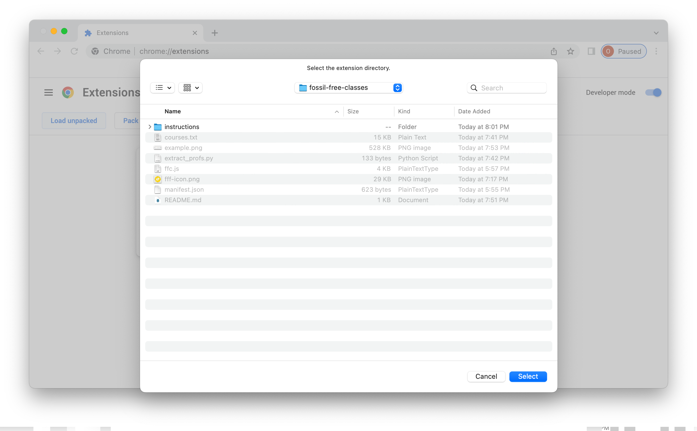

# GW Fossil Free Classes
This Chrome extension adds an icon () next to Fossil Free Faculty names in course lists on GWeb to quickly identify professors dedicated to climate justice. For more information about Fossil Free Classes, see [the website](https://sunrisegw.org/fossil-free-classes).

## Installation
1. Download this repository as a zip file: [download](https://github.com/ozzy-simpson/gw-fossil-free-classes/archive/refs/heads/master.zip). Unzip the folder.
2. In Chrome, go to `chrome://extensions/`
    
3. Enable "Developer mode" in the top right.
    
4. Click "Load unpacked" in the top left and select the folder you downloaded in step 1.
    
5. You should see the extension appear in the list of extensions. If you don't, try reloading the page. Ensure that the extension is enabled.
    
6. Go to GWeb and search for a course. You should see the icon next to Fossil Free Faculty names.
    
